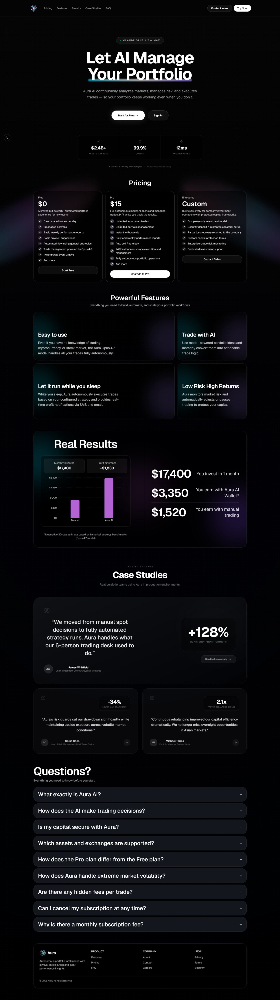

# Aura AI Wallet — Next-Gen Portfolio Intelligence

A premium, AI-native autonomous trading platform built with **Next.js 15** and **Claude Opus 4.8**. Aura manages your crypto portfolio 24/7, executing strategies with millisecond latency and institutional-grade risk controls.

## 💎 Design & Preview

Aura features a high-end **Glassmorphism UI** with smooth **Framer Motion** animations, custom **Aurora Backgrounds**, and a consistent monochromatic design language.



### 📊 Professional Dashboard
- **Performance Analytics**: High-fidelity charts showing Aura AI vs Market benchmarks, monthly returns, and key risk metrics (ROI, Drawdown, Win Rate).
- **Market Data & News**: Real-time TradingView charts integrated with a global financial and political news feed (Google News RSS).
- **Investments Overview**: Real-time asset allocation tracking with animated distribution charts.
- **Active Strategies**: Live view of AI-managed positions (Long/Short) with real-time P&L.

### ⚡ Neural Onboarding
A multi-step, AI-guided onboarding flow that calculates risk profiles and expected returns through a "Neural Optimization" loading state with real-time telemetry.

### 🔐 Secure Deposits (OxaPay)
- **White-Label Integration**: Fully integrated OxaPay Merchant API for seamless crypto deposits without external redirects.
- **Multi-Network Support**: Support for BTC, ETH, SOL, and USDT across various networks (TRC20, ERC20, BEP20).
- **Dynamic QR Codes**: Secure, logo-integrated QR generation for wallet addresses using `qrcode.react`.
- **Webhook Verification**: Production-ready webhook listener with HMAC SHA512 signature verification for secure transaction confirmation.

### 🛡️ Admin Powerhouse (Admin Panel)
A robust, role-based administrative interface for platform oversight and user management.
- **Financial Analytics**: Real-time deposit volume tracking with chronological charts and automatic multi-asset conversion (BTC/ETH to USD).
- **User Management**: Comprehensive control center to manage user roles, reset security credentials (passwords), and bypass 2FA/TOTP locks.
- **Wallet Inspection**: Live view of any user's asset allocation and balances across all integrated networks.
- **Security & RBAC**: Advanced database-level security with custom Supabase RLS policies and `is_admin()` functions for safe administrative access.

### 📰 Editorial Case Studies
Dynamic, editorial-style case studies featuring real-world investment firms (Grayscale, BlockTower, Pantera) with detailed performance metrics and strategic insights.

## 🛠 Tech Stack

- **Framework**: [Next.js 15 (App Router)](https://nextjs.org/)
- **Language**: [TypeScript](https://www.typescriptlang.org/)
- **Styling**: [Tailwind CSS v4](https://tailwindcss.com/)
- **Animations**: [Framer Motion](https://www.framer.com/motion/)
- **Charts**: [Recharts](https://recharts.org/) for high-performance data visualization.
- **AI Engine**: [Anthropic Claude Opus 4.8](https://www.anthropic.com/)
- **Payment Gateway**: [OxaPay Merchant API](https://oxapay.com/)
- **Icons**: [Lucide React](https://lucide.dev/) & [Simple Icons](https://simpleicons.org/)


## 🏁 Getting Started

1. **Install Dependencies**:
   ```bash
   npm install
   ```

2. **Run Development Server**:
   ```bash
   npm run dev
   ```

3. **Visit Localhost**:
   Open [http://localhost:3000](http://localhost:3000).

## 📁 Project Structure

- `app/dashboard/` - Core application logic and private views.
- `app/admin/` - Administrative control panel and user management.
- `app/api/admin/` - Secure administrative backend endpoints.
- `app/studycase/` - Dynamic case study detail pages.
- `components/admin/` - Specialized UI components for the admin interface.
- `components/dashboard/` - Specialized UI components for the trading interface.
- `components/landing/` - High-conversion marketing sections and landing UI.
- `lib/` - Shared data, types, and utility functions.

---

© 2024 Aura AI. Built for the future of autonomous finance.
