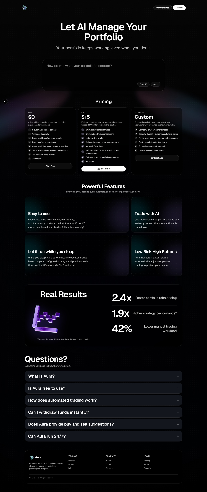

# Aura Wallet Landing

A modern Next.js landing page for Aura Wallet with a dark glass UI, aurora background, pricing tiers, feature showcase, results panel, FAQ section, and auth screens.

## Preview



## Tech Stack

- Next.js (App Router)
- React
- TypeScript
- Tailwind CSS v4

## Available Pages

- `/` - Landing page
- `/login` - Login screen
- `/register` - Register screen

## Run Locally

```bash
npm install
npm run dev
```

Open [http://localhost:3000](http://localhost:3000).

## Project Structure

- `app/page.tsx` - Main landing page composition
- `components/landing/*` - Landing page sections/components
- `components/auth/*` - Login and register UI components
- `app/globals.css` - Global styles and visual theme

## Scripts

- `npm run dev` - Start development server
- `npm run build` - Build for production
- `npm run start` - Start production server
- `npm run lint` - Run ESLint
